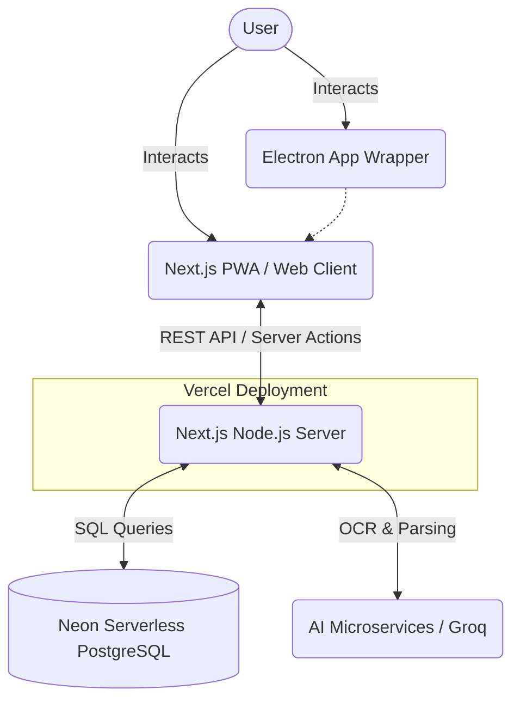
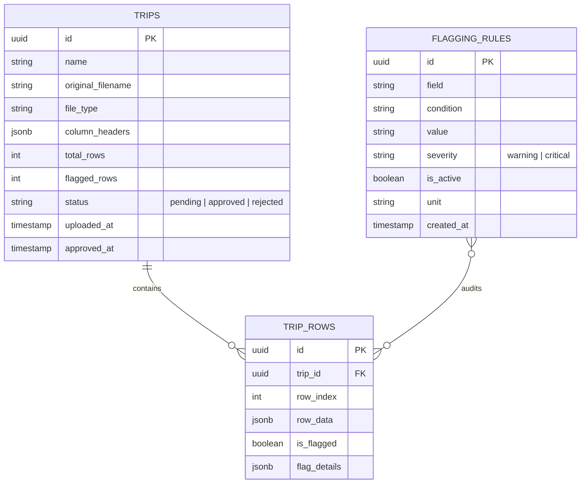

# TripFlag: Enterprise System Design & Architecture Document

This document serves as the **Single Source of Truth** for the architecture, infrastructure, data models, and deployment strategy of the TripFlag platform. It is intended for senior engineers, architects, and DevOps personnel to understand the end-to-end flow of the system.

---

## 1. Executive Summary

TripFlag is an enterprise-grade web and desktop platform for ingesting, standardizing, and automatically auditing trip data (via spreadsheets, PDFs, or images) using AI-driven Optical Character Recognition (OCR) and an internal rule-based flagging engine. 

The application is engineered with a **Next.js (App Router)** frontend/backend monorepo, packaged natively for desktop using **Electron**, and relies on a **Neon Serverless PostgreSQL** database.

---

## 2. High-Level Architecture

### Components
1. **Frontend (Client)**: Built with React 19 and Next.js App Router. Features a premium UI with Lucide scalable icons, skeleton loaders for asynchronous state handling, and a custom CSS global theme utilizing CSS variables for dark/light mode scaling.
2. **Backend (Server)**: Node.js endpoints inside Next.js `/app/api`. Handles secure communication to the AI services and database.
3. **Database**: PostgreSQL hosted on Neon (Serverless), scaling computing resources instantly from zero.
4. **Desktop Wrapper**: A lightweight Electron shell (`desktop-app/main.js`) that runs the web app locally with a native OS feel, injecting CSS to hide web-only UI elements (e.g., the download button).
5. **AI Services**: Used for extracting rows from images and PDFs using Groq SDK (`/api/ocr`, `/api/parse-pdf`).

---

## 3. Database Schema

The database relies on three core tables structured to maintain high relational integrity between uploads, the raw data, and the auditing rules.

### Entity Relationship Diagram

### 3.1. `trips` Table
Stores metadata for every file uploaded.
- **`status`**: Critical state machine field. Defines whether a trip is in the pending review state, or has been permanently approved/rejected.
- **`column_headers`**: JSONB array storing the exact normalized headers extracted from the uploaded document.

### 3.2. `trip_rows` Table
Stores individual row data. Normalizes spreadsheet grids and OCR output into individual JSON payloads.
- **`row_data`**: JSONB representation of a single parsed row (e.g., `{"Driver": "John", "Fuel": 120}`).
- **`flag_details`**: JSONB array appended by the Flagging Engine containing exact violation data (`[{"field": "Fuel", "severity": "critical", "reason": "Fuel > 100"}]`).

### 3.3. `flagging_rules` Table
Maintains the dynamic business logic parameters. Admins can update these rules on the fly.
- **`condition`**: Enumerated logic operators (`equals`, `contains`, `greater_than`, `less_than`, `is_empty`).

---

## 4. Core Workflows

### 4.1. File Ingestion & Parsing Workflow
1. **Upload**: User drops a file (XLSX, CSV, PDF, JPG, PNG).
2. **Identification**: System identifies MIME type and routes to the correct parser.
3. **Extraction**:
   - *Spreadsheets*: Processed locally via `xlsx` library. Header index is intelligently determined via AI fallback.
   - *PDFs/Images*: Processed via `pdfjs-dist` and OCR AI endpoints.
4. **Data Normalization**: Rows are sanitized and pushed to `/api/trips`.
5. **Persistence**: `trips` and `trip_rows` are created.

### 4.2. Flagging Engine Workflow (`/api/flag`)
1. Triggered immediately after file parsing.
2. System fetches all `is_active = true` rules from `flagging_rules`.
3. Iterates over every row in `trip_rows`.
4. Evaluates `row_data` against the rule conditions (handling type casting for numbers vs strings automatically).
5. If a rule is violated, `is_flagged` is set to `true`, and the specific rule metadata is pushed into `flag_details`.
6. Rolls up the total flagged row count and updates the parent `trips` record.

---

## 5. Deployment Strategy

### Web Application (Vercel)
- **Framework**: Next.js App Router (v16+).
- **Environment**: Node.js edge/serverless execution.
- **CI/CD**: Connected directly to the GitHub `main` branch. Pushes automatically trigger build, linting, and zero-downtime deployments.
- **Logs**: Forwarded externally to a dedicated logging dashboard (`https://tripflag-logs.vercel.app/`).

### Desktop Application (GitHub Releases)
- **Packaging**: Electron Builder.
- **Artifact**: `.exe` (Windows).
- **Distribution**: Hosted as GitHub Release Assets. The Web UI pulls the latest `TripFlag.Setup.1.0.1.exe` directly from the release bucket.

### Database (Neon Serverless)
- **Connection**: TCP/IP via pooled connection strings (`DATABASE_URL`).
- **Cold Starts**: Neon's instant-wake technology guarantees sub-10ms wake times, effectively eliminating traditional serverless database cold-start penalties.

---

## 6. Enterprise UI/UX Standards

- **Iconography**: Strict adherence to **Lucide React** scalable vectors. Emojis are explicitly banned in the UI to maintain professionalism.
- **Feedback**: Uses `react-hot-toast` for non-blocking, elegant system notifications.
- **Async States**: Implements CSS animated Skeleton loaders (`loadingShimmer` keyframes) to prevent layout shift during data fetching.
- **Global Components**: 
  - Centralized layout wrapper (`app/layout.js`).
  - Context-aware `BackButton.js` for deep-app routing.
  - Fixed, non-intrusive global footer for licensing compliance.
- **Changelog**: Driven by a local `changelog.json` source of truth, rendered dynamically.

---

## 7. Security & Error Handling

- **Database**: Parameterized SQL queries via the tagged template literal `` sql`...` `` to prevent SQL injection.
- **File Validation**: Strict frontend and backend MIME-type validation.
- **Graceful AI Degradation**: If AI structured-analysis fails on a spreadsheet, the system gracefully falls back to deterministic standard parsing to ensure user workflow is never entirely blocked.
